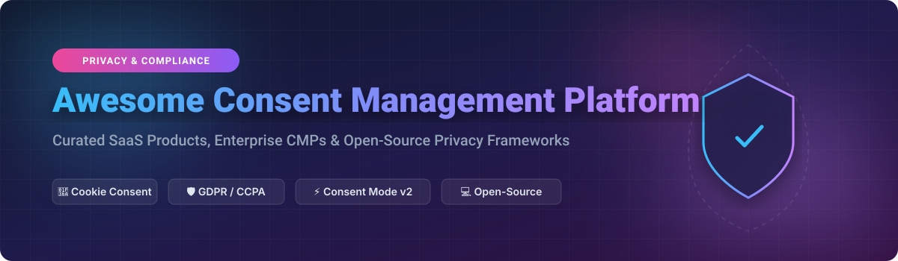

# 🛡️ Awesome Consent Management Platform (CMP) Ecosystem

  
  
  
  

---

## 📌 Top Consent Management Platforms (CMP) & Data Privacy Ecosystem

**Curated List of Enterprise SaaS Products, Developer Tools & Open-Source GitHub Projects**

*Focused on Cookie Consent Banners, GDPR / CCPA / CPRA / LGPD Compliance, Google Consent Mode v2 & Automated Data Privacy Compliance.*

**Last updated: September 2026** 📅

---

### 🔍 Overview & Market Intelligence

This repository tracks notable **SaaS platforms** and **open-source projects** for **Consent Management Platforms (CMP)**. These tools help websites, web applications, and mobile apps collect, store, manage, and document user consent for cookies, tracking scripts, and data processing in strict compliance with global privacy regulations (GDPR, CCPA/CPRA, ePrivacy, LGPD, and Google Consent Mode v2).

📊 **Market Size & Structure**: The global Consent Management Platform (CMP) market is estimated at **$750 Million – $1.1 Billion** (2026), projecting rapid expansion driven by stringent data privacy enforcement worldwide. The sector is **moderately concentrated at the top enterprise tier** (dominated by OneTrust and TrustArc holding ~50% market share) while remaining **highly fragmented across SMB, developer-centric, and open-source self-hosted solutions**.

---

## 📚 Table of Contents

- [🏢 SaaS & Hosted Commercial Platforms](#-saas--hosted-commercial-platforms)
- [💻 Open-Source GitHub Projects](#-open-source-github-projects)
- [🤝 How to Contribute](#-how-to-contribute)
- [⚖️ Disclaimer](#️-disclaimer)
- [💖 Support & Sponsorship](#-support--sponsorship)
- [📈 Star History](#-star-history)

---

## 🏢 SaaS & Hosted Commercial Platforms

Below is a comparative breakdown of leading enterprise and SMB Consent Management SaaS solutions, sorted by **company size / valuation / ARR (descending)**:

| Provider 🏢 | Company Size / Valuation / ARR 💰 | Specific Starting Price 🏷️ | Free Tier / Trial Limit 🎁 | Description 📝 |
| :--- | :--- | :--- | :--- | :--- |
| **[OneTrust](https://www.onetrust.com/)** 🚀 | **$4.5 Billion** valuation ($550M+ ARR) | $10,000 / year (Minimum contract) | ❌ No free tier or trial (Sales demo required) | Dominant enterprise privacy, consent & data governance platform. Provides comprehensive cookie banners, preference centers, and automated vendor scanning. |
| **[Usercentrics](https://usercentrics.com/)** 🛡️ | **$117 Million+** ARR (€100M Centaur) | €7 (~$8) / month | 🆓 Free Plan for 1 domain (Up to 50 subpages / basic features) | European market leader with cookie consent banners, mobile app SDKs, and full Google Consent Mode v2 integration. |
| **[TrustArc](https://trustarc.com/)** 🔒 | **$109 Million** raised ($50M+ ARR) | $15,000 / year (Starting contract) | ❌ No free tier (Custom enterprise pilot available on request) | Enterprise-grade privacy management, cookie consent banners, automated assessments, and ISO/TRUSTe compliance certification. |
| **[Crownpeak](https://www.crownpeak.com/)** 🌐 | **$90 Million** valuation ($70M ARR) | $1,500 / month | ❌ No free tier (Custom demo only) | Digital Experience Platform (DXP) with deeply integrated consent management and web accessibility compliance tools. |
| **[Didomi](https://www.didomi.io/)** 🇫🇷 | **$40M - $60M** ARR ($128M+ raised) | €250 / month | ⏳ 14-day free trial (Full enterprise features access) | French CMP & preference management platform tailored for mid-market and enterprise publishers requiring custom consent logic. |
| **[Osano](https://www.osano.com/)** ⚖️ | **$25M - $40M** valuation | $199 / month (Plus Plan) | 🆓 Free Tier up to 5,000 monthly unique visitors | Developer-friendly privacy platform featuring CMP, cookie consent auto-blocking, data mapping, and vendor privacy monitoring. |
| **[Consentmanager](https://www.consentmanager.net/)** 🇩🇪 | **$15M - $25M** revenue | €23 (~$25) / month | ⏳ 14-day free trial (Up to 10,000 pageviews during trial) | German CMP provider offering customizable cookie banners, high consent rate optimization, and optional self-hosted enterprise deployment. |
| **[Ethyca](https://www.ethyca.com/)** ⚡ | **$44 Million** raised ($2.8M ARR) | $490 / month (Fides Pro) | ⏳ 30-day free trial for cloud platform (Fides OS is open source) | Automated privacy-as-code infrastructure platform offering consent management, automated DSAR handling, and developer data mapping. |
| **[Iubenda](https://www.iubenda.com/)** 📜 | **$15M - $20M** revenue | $5.99 / site / month | 🆓 Free Tier limited to 25,000 pageviews/mo & basic cookie policy | Italian legal tech platform providing cookie banners, privacy policy generation, terms of service, and consent solution bundles. |
| **[CookieYes](https://www.cookieyes.com/)** 🍪 | **$10M - $15M** revenue | $10 / domain / month (Basic Plan) | 🆓 Free Plan for 1 domain up to 5,000 pageviews/month | Popular, lightweight CMP offering automated cookie scanning, customizable banners, and full Google Consent Mode v2 support. |
| **[Termly](https://termly.io/)** 📑 | **$5M - $10M** revenue | $14 / site / month (Billed annually) | 🆓 Free Plan for 1 website up to 10,000 monthly site visits | All-in-one compliance platform for SMBs providing cookie consent banners, privacy policy generators, and Terms of Service tools. |

---

## 💻 Open-Source GitHub Projects

Curated list of self-hosted, developer-first open-source consent management libraries and cookie banners. Sorted by **GitHub Stars_Count (descending)**:

*  **[vanilla-cookieconsent](https://github.com/orestbida/cookieconsent)** 🌟  
  A lightweight, ultra-fast, cross-browser cookie consent plugin written in pure vanilla JavaScript. Features multi-language support, customizable modal UI, auto-blocking scripts, and zero dependencies. High performance & compliance-ready. **MIT License**.

*  **[Osano Cookie Consent](https://github.com/osano/cookieconsent)** 🛡️  
  The popular open-source JavaScript plugin originally created by Insites and maintained by Osano. Designed to alert users about the use of cookies on websites with customizable themes and compliance presets for EU/GDPR. **MIT License**.

*  **[Consent-O-Matic](https://github.com/cavi-au/Consent-O-Matic)** 🤖  
  Browser extension built by computer science researchers at Aarhus University that **automatically fills out cookie consent popups** based on user privacy choices. Works across hundreds of CMP formats. **MIT License**.

*  **[Klaro!](https://github.com/kiprotect/klaro)** 🌿  
  The most established standalone open-source consent manager UI. Lightweight (57 kB gzipped), privacy-friendly, multilingual, and compliant with GDPR/ePrivacy. Ensures no third-party scripts run without explicit consent. Integrates with **TYPO3**, **Shopware 6**, **Matomo**, and **Next.js**. **MIT License**.

*  **[Orejime](https://github.com/boscop-fr/orejime)** ♿  
  An accessible, GDPR-compliant cookie consent manager for websites. Prioritizes WCAG accessibility guidelines, keyboard navigation, and custom script loading control. **MIT License**.

*  **[ConsentOS](https://github.com/consentos/consentos)** ⚙️  
  Self-hosted, multi-tenant cookie consent management platform built as an open alternative to OneTrust and CookieYes. Features Playwright cookie scanner, dark pattern detection, auto-blocking, and tamper-evident audit trails. **ELv2 License**.

*  **[PrivacyLens](https://github.com/SALT-NLP/PrivacyLens)** 🔬  
  Next-generation research-backed consent management framework developed at Carnegie Mellon University focusing on granular user attribute privacy preferences and affirmative consent UI/UX models. **MIT License**.

*  **[WSO2 OpenFGC](https://github.com/wso2/openfgc)** 🏗️  
  Industry-agnostic, developer-first fine-grained consent management engine built in Go. Manages consent elements, legal justifications, status lifecycles, and immutable record logs. **Apache-2.0 License**.

---

### 🧩 Additional Open-Source Libraries & Ecosystem Tools

- **⚡ Lightweight Banners**: **Biscuitman** (Super lightweight cookie banner), **novaConsent** (Pure vanilla JS banner), **EasyCookies** (Customizable cookie consent modal).
- **🔌 Framework Integrations**: Klaro integrations for **TYPO3**, **Shopware 6**, **Matomo**, **PrestaShop**, **Bootstrap 5**, **Next.js**, and **SvelteKit**.
- **🧪 Compliance & Auditing Tools**: **Cookinspect** (Selenium crawler detecting IAB TCF violations), **Cookie-Glasses** (Browser extension verifying consent choices against network requests).

---

## 🤝 How to Contribute

Contributions are welcome! Please follow these simple steps:

1. Fork this repository 🍴
2. Create your feature branch (`git checkout -b feature/awesome-cmp`)
3. Commit your changes (`git commit -m 'Add awesome CMP tool'`)
4. Push to the branch (`git push origin feature/awesome-cmp`)
5. Open a Pull Request 🚀

*Please keep descriptions objective, factual, and include pricing / open-source licensing details where appropriate.*

---

## ⚖️ Disclaimer

- This repository is a **community-curated** educational resource and does not constitute formal legal advice.
- Implementing a CMP tool alone does not guarantee compliance with privacy laws (GDPR, CCPA, CPRA, LGPD). Always consult legal counsel to ensure compliance for your specific data processing activities.

---

## 💖 Support & Sponsorship

If you find this repository helpful for your application security, web development, or privacy compliance workflow:

- ⭐ **Star** this repository to help others discover it!
- 🔀 **Fork** it to keep your own reference copy.
- 📢 **Share** it with your developer and compliance colleagues.
- ☕ **Buy me a coffee**: Support ongoing open-source curation and maintenance via the [GitHub Sponsors Dashboard](https://github.com/sponsors/ishandutta2007)!

---

## 📈 Star History

---

  <b>Made with ❤️ for privacy engineers, developers, and compliance officers worldwide.</b>

